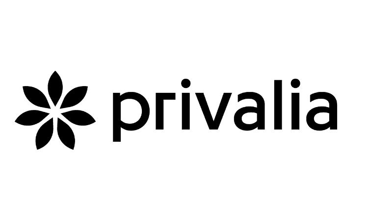

# EDUARDO BAÑOS

#### FRONT-END DEVELOPER

## Profile

Being a Front-End Developer has exposed me to a diverse array of projects, enriching my technical skill set. I'm driven by a passion for technology, constantly seeking to stay updated with the latest industry trends and refine my abilities.<br/><br/>
Embracing new challenges for my personal and professional growth. I value teamwork, adaptability, and effective communication, fostering a collaborative work environment. I aim to consistently deliver high-quality work as a dedicated web developer.

## Experience

<p align="center">
  
</p>

---

<p align="right">
  
</p>

## Internal Appscript project
### July 2023 - September 2023

Integrated Appsheet views with Appscript and Google Sheets, optimizing data flow and project performance.

```
Aptitudes: Appscript · Appsheet · JavaScriptAptitudes
```

<br />
<p align="right">
  
</p>

##  Royal Caribbean - Marketing Team
### September 2022 - July 2023

As the primary developer for the project, I undertook diverse respon- sibilities. Key tasks included:
* Managing the LivePerson Conversational Cloud Platform, overseeing configurations across test, pre-production, and production environ- ments
* Collaborating in project definition processes by creating user stories, subtasks, and facilitating client and Globant team coordination
* Conducting in-depth research on the LivePerson platform to optimize its functionality within the project framework
* Designing, creating, and maintaining bots for Celebrity and Royal Caribbean brands
* Steering campaign creation and ensuring their ongoing mainte- nance
* Configuring metadata events sent to LivePerson and customizing chatbot settings.
* Establishing regional campaign configurations and managing user creation, configuration, and deletion on a per-brand and per-skill basis
* Developing predefined content and customizing UI logos (including SVG logo modification for optimal cross-browser display)
* Engaging in debugging, issue resolution, and imparting knowledge to team members
* Conducting interviews with potential team members and generat- ing metric reports
* Providing comprehensive support to the QA team during testing phases

```
Aptitudes: Live Person · Bots · UX · Scrum · JavaScript · Figma
```

<br />
<p align="right">
  
</p>

## Food52 Inc - Sw Services
### April 2022 - August 2022

Within the project, I spearheaded the development efforts and accomplished various tasks, such as:
* Crafting and updating email templates on Sailthru & Litmus, refining their design and effectiveness
* Addressing issues related to Google Tag Manager by conducting bug fixes, ensuring its smooth operation for efficient data handling

```
Aptitudes: Litmus · Sailthru · Google Tag Manager · JavaScript
```

<br />
<p align="right">
  
</p>

## Skillshare Inc. - Internationalization
### September 2021 - April 2022

* Decorating Formatjs React components and extracting strings for enhanced localization
* Applying decoration and string extraction to Formatphp files for improved internationalization
* Rectifying React & PHP test errors resulting from string extraction tasks, ensuring code accuracy and functionality

```
Aptitudes: formatjs · formatphp · JavaScript · React
```

<br />
<p align="right">
  
</p>

## Privalia - Migration TM
### July 2020 - September 2020

* Successful migration of artifacts, predominantly written in PHP, ensuring smooth transition
* Transferred codebase from Gitlab to AWS Code Commit for improved version control and management
* Customized and updated artifacts on destination servers to align with project requirements
* Resolved bugs and conducted necessary fixes to ensure optimal functionality throughout the migration process

```
Aptitudes: Code Commit AWS · GitLab · GitHub · CentOS · Docker
```

<br />
<p align="right">
  
</p>

## Disney Parks - Reference Architecture
### September 2019 - April 2020

Contributed to the Reference Architecture team at Walt Disney Attractions Technology, focusing on:
* Migrating Web Components from Polymer 2 to Polymer 3 to enhance performance
* Upgrading Polymer component demos from AngularJS to Angular 8 for improved functionality
* Facilitating the migration of Node.js modules from JavaScript to TypeScript for better code maintainability
* Conducting comprehensive reviews of NPM packages and executing demonstrative implementations for optimal performance and compatibility

```
Aptitudes: Npm · Nodejs · Polymer · Scrum · JavaScript
```
<br />

<p align="center">
  
</p>

<br />

<p align="right">
  
</p>

## BBVA - Bancomer Seguros
### September 2019 - April 2020

* Collaborated on the development of quoters for the “Mamá Segura” and “Meta Educación” websites
* Conducted maintenance tasks for the “PorSiempre” website to ensure its optimal performance
* Implemented dynamic fields within PDFs for CFDI invoices, enhanc- ing their functionality
* Provided support within the UX domain, involving the creation and updating of wireframes, navigable prototypes using Sketch and Zeplin, and the execution of web mockups
* Updated designs for CFDI invoice scripts to improve their aesthetics and functionality

<br />

<p align="right">
  
</p>


## BBVA/IDS Mobile Scholarship
### September 2019 - April 2020

Completed a mobile development scholarship focusing on iOS
```
Aptitudes: Xcode · Objective-C · UX · JavaScript · Sketch
```

## Skills

### Coding Tools

| HTML     | Javascript   | Appscript   | NPM
| PUG      | Typescript   | Jekyll      | NodeJS
| CSS      | Polymer      | Storybook   | Jest
| SASS     | React        | Appsheet    | FormatJS

### Other Tools

| Google Tag Manager     | Centos   | Scrum
| Live Person            | Github   |
| Docker                 | Gitlab   |
| Jenkins                | Scrum    |

### UX Tools

| HTML     | Javascript   | Appscript   | NPM
| PUG      | Typescript   | Jekyll      | NodeJS
| CSS      | Polymer      | Storybook   | Jest
| SASS     | React        | Appsheet    | FormatJS
